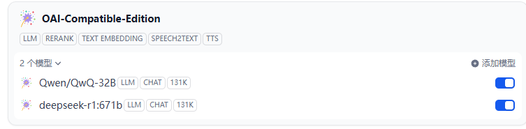

## Overview

This plugin provides access to models that are OpenAI-compatible, including LLMs, reranking, text embedding, speech-to-text (STT), and text-to-speech(TTS) models. Developers can easily add models by providing configuration parameters such as the model name and API key.

## Quick Start


## Development Guide

Fill in the Dify plugin debugging configuration, [Related Documentation](https://docs.dify.ai/plugins/quick-start/develop-plugins/debug-plugin)

```bash
cp .env.example .env
```

```ini
#  Modify with your own configuration
INSTALL_METHOD=remote
REMOTE_INSTALL_HOST=192.168.1.53
REMOTE_INSTALL_PORT=5003
REMOTE_INSTALL_KEY=bd42388c********9b1d8e8b
```


Install plugin dependencies:

```bash
uv pip install -r requirements.txt
```

Run debug server:

```bash
uv run main.py
```

Add model in your Dify workspace:




Package plugin:

```bash
./dify-plugin-windows-amd64.exe plugin package ../oai_compatible_edition
```